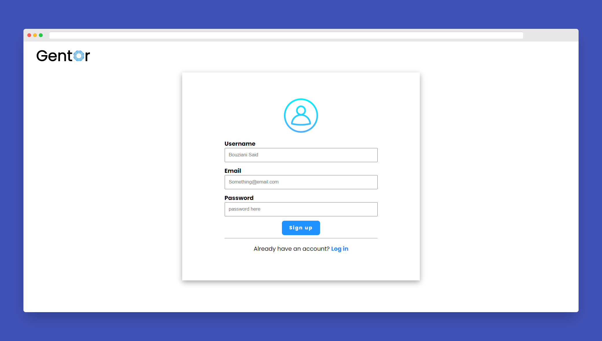
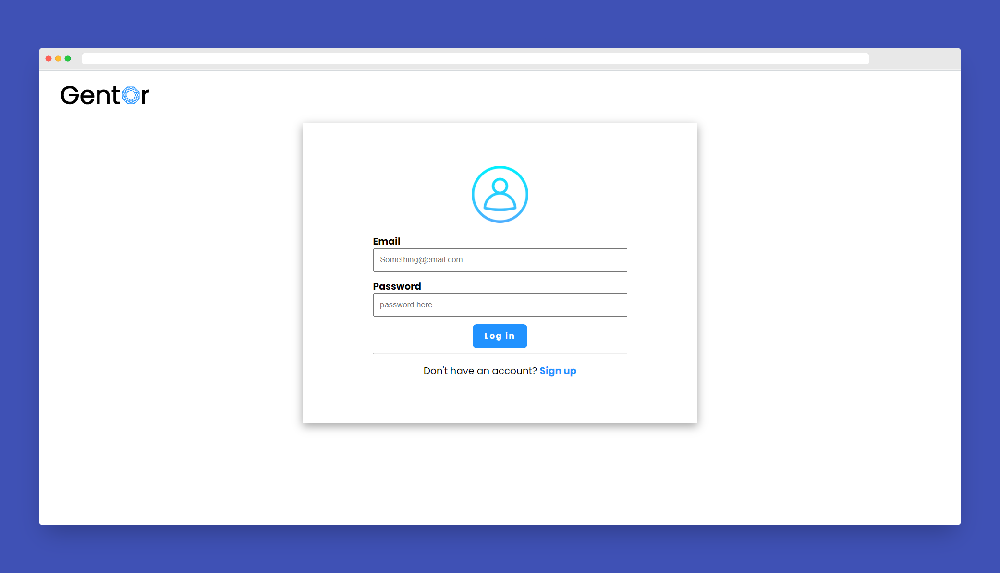
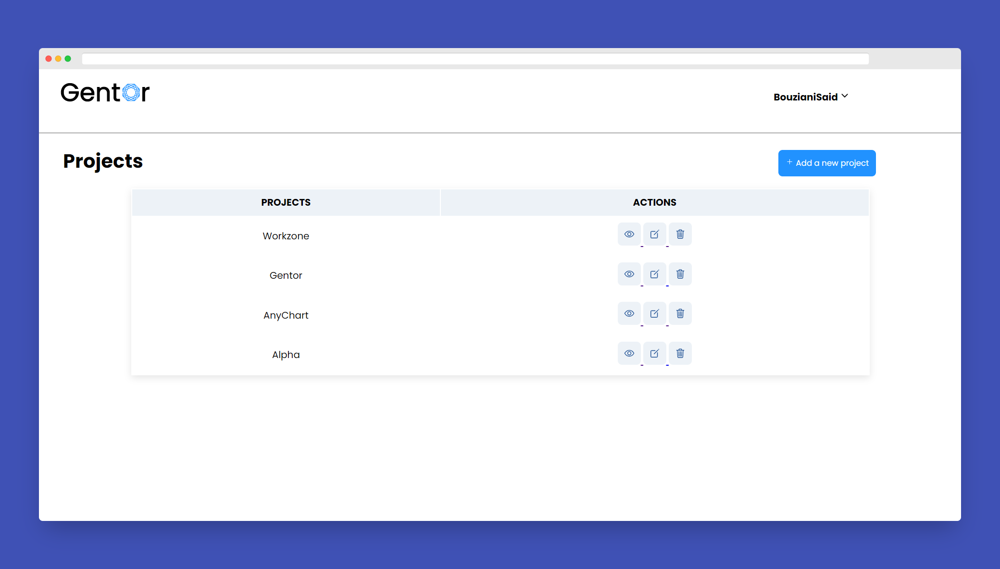
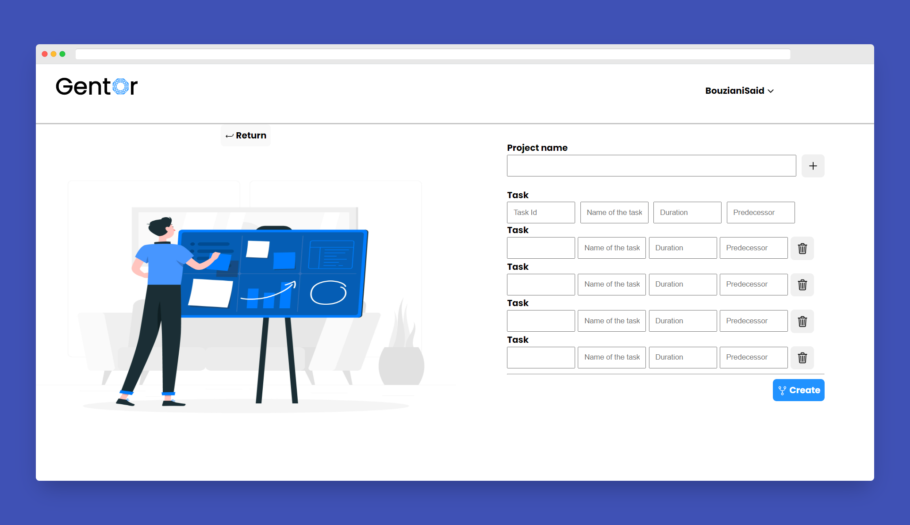
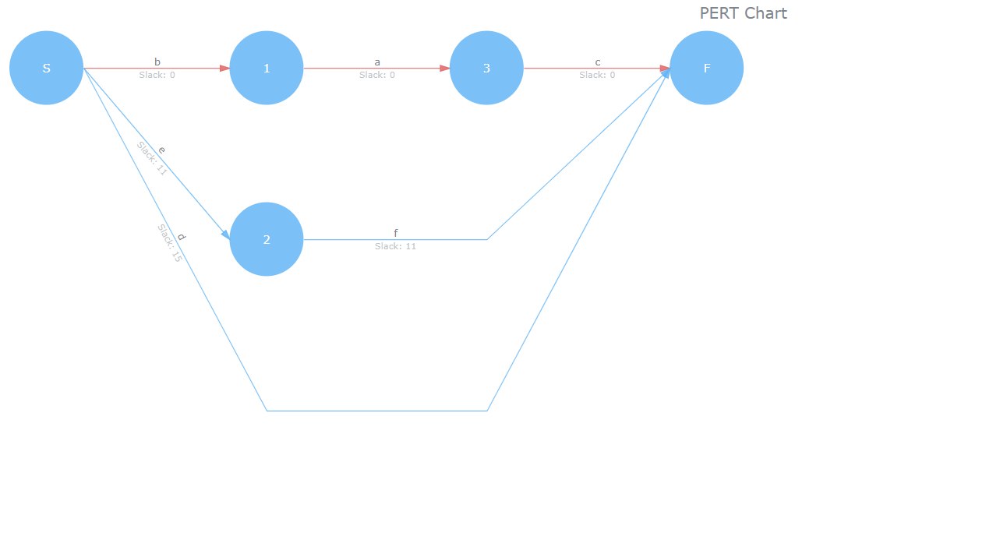

# Gentor: PERT Chart Generator

Gentor is a web application that helps you create PERT charts for your projects. With Gentor, you can easily visualize your project's tasks, dependencies, and timelines in a beautiful and informative PERT chart.

## API 
The Api used is AnyChart API

## Programming Languages
1. PHP
2. JavaScript

## Database
MySql

## Techs
JSON

## IDE 
VsCode

## UI

## About GentorFlow

GentorFlow is a project management tool designed to streamline your workflow and help you create beautiful and informative PERT charts. It was developed by a team of experienced project managers and software developers who understand the importance of visualizing project data in a clear and concise way.

## Credits
This Web Application was developed by [Said Bouziani]
